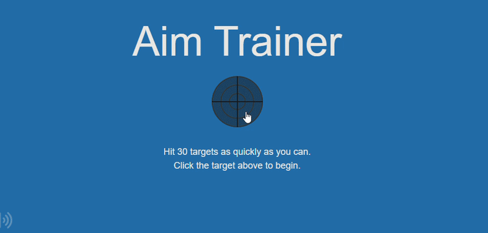
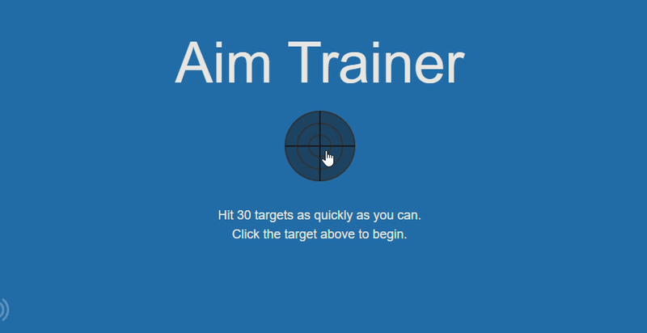
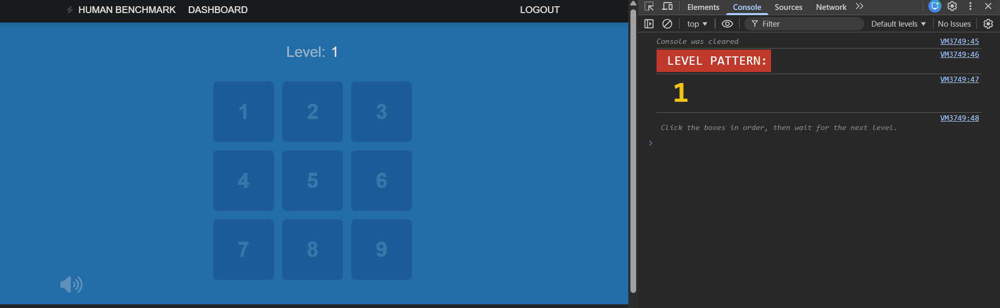
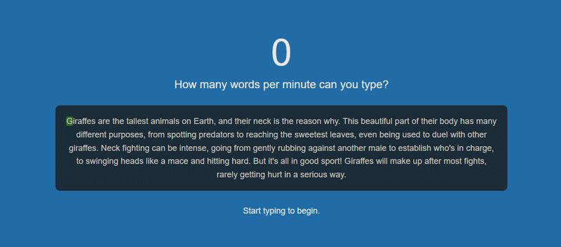

[](https://github.com/pixelatedxp/human-benchmark-cheats)

# Human Benchmark Cheats

A structured repository containing scripts to automate and solve various [Human Benchmark](https://humanbenchmark.com/) tests.

> **Disclaimer**: This was created purely for fun. The code might not be optimized or follow best practices. All scripts and methods were tested and working as of **02/03/2026**. I might update the repository if issues arise or if new games are added to the site. Please note that some of the GIF clips below are sped up for demonstration purposes.

The goal of this repository is to show how to automate interactions with a website, read or modify data from the page using the DOM, and use computer vision techniques to react quickly in fast-paced scenarios.

## Overview

This repository includes three main ways to use the cheats:
1. **Chrome Extension**: A full-fledged UI to auto-detect the current test and inject the corresponding cheat.
2. **JavaScript Files (.js)**: Intended to be executed directly in the browser's Developer Console.
3. **Python Files (.py)**: External scripts utilizing modules like `OpenCV` and `pyautogui` for screen reading and simulated input.

## My Profile Statistics


## Features

### Aim Trainer
- **aimbot_fast.py**
  
  
  
  Rapid reaction aiming script using OpenCV to find targets and click them quickly.
- **aimbot_slow.py**
  
  
  A slower version that uses a circle-detection method to click targets smoothly without looking suspicious.
  
### Chimp Test
- **chimp_instant.js**
  
  
  
  Instantly solves the entire sequence without delay.
- **chimp_delayed.js**
  
  Solves the sequence automatically but adds a small delay to simulate human input.

### Number Memory
- **number_memory_instant.js**
  
  
  
  Automatically captures the number and injects the answer natively.
- **number_memory_timer.js**
  
  Contains an automatic kill-switch (5 minutes) so it doesn't run indefinitely.
- **number_memory_watch_mode.js**
  
  Auto-solves the number memory until it hits Level 40 exactly, then intentionally fails to record the score.

### Reaction Time
- **reaction_time_instant.js**
  
  
  
  Console script using DOM mutation observers to click instantly on green (0-4ms)
- **reaction_time_vision.py**
  
  External Python script leveraging `mss` to monitor a tiny pixel region for exact color changes, simulating external aim assistance. (Depends on monintor refresh rate) 

### Sequence Memory
- **sequence_memory_auto.js**
  
  
  
  Watches the full sequence flash out, then takes over and successfully repeats it.
- **sequence_memory_visualizer.js**
  
  
  
  Places numeric overlays on top of the tiles during the sequence, and then shows the sequence in console.

### Typing Test
- **typing_bot_instant.js**
  
  Immediately blasts every key sequence into the text area instantly. (~4 million words per minute)
- **typing_bot_700wpm.js**
  
  
  
  Recovered slower bot utilizing intervals to naturally type at a sustained rate of 700+ WPM.

### Verbal Memory
- **verbal_memory_rapid.js**
  
  
  
  Very fast clearing bot looping at 10ms to easily push huge numbers.
- **verbal_memory_stable.js**
  
  Consistent solving script at a relaxed pace.

### Visual Memory
- **visual_memory_bot.py**
  
  
  
A Python script using OpenCV that looks at the board, saves the white tile positions, and then clicks them in order.

### Utilities
- **bot_killer.js**: Disconnects all Javascript timeout cycles, intervals, and mutations active at the given moment, preventing loops.
- **region_finder.py**: Fast and easy terminal setup tool to draw bounding boxes and output coordinate sizes specifically for OpenCV region monitoring.

## Setup & Execution

### JavaScript Scripts (.js)
1. Navigate to the desired test on the Human Benchmark website.
2. Press `F12` (or `Ctrl+Shift+I` on Windows, `Cmd+Option+I` on Mac) to open Developer Tools.
3. Switch to the **Console** tab.
4. Copy the contents of the `.js` file you want to use.
5. Paste it in the Console and hit `Enter`. 

### Python Scripts (.py)
Make sure you have a working Python 3 installation.

1. Install dependencies:
   ```bash
   pip install opencv-python numpy pyautogui mss keyboard
   ```
2. Run the script from the command line:
   ```bash
   python script_name.py
   ```
3. Typically, you will be prompted to press `Q` to start or stop, and `ESC` to force a hard exit. Read the terminal output for specific instructions for each script.

### Chrome Extension

The easiest method for JS-based cheats. This Chrome extension automatically detects your current test and provides a clean UI for instant injection, no need to open the terminal or console.

   


1. Go to `chrome://extensions/` in Chrome.
2. Toggle on **Developer Mode** in the top right corner.
3. Click **Load unpacked** in the top left.
4. Select the `chrome extension` folder located inside this repository.
5. Go to humanbenchmark.com, pin the extension to your toolbar, and click it to open the cheat menu.

## Disclaimer Note

This project was made only for learning, showing logic examples, and explaining weaknesses in client-side checks. Do not use it to cheat or affect the Human Benchmark leaderboards.


